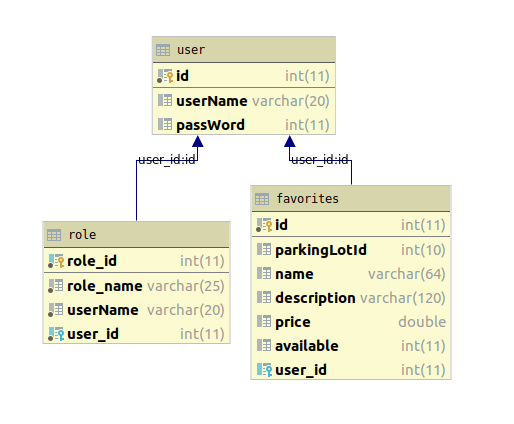

# Parking Lot Search App

### Problem Statement - 
    As a user I want to search for the available parking lots within the radius of a zipcode. 
    I as a user, also want to mark/unmark any favorite parking lots I visit often.
    The application should have authentication enabled and remember my favorites. 
    
### Technologies implemented - 
    Zipcode public api call
    Call to a mock service for getting a list a parking lots and their prices
    Tomcat authentication
    Junit5
    Hibernate - Generic Dao
    SpringBoot - rest, mockito (unit testing by mocking services)
    swagger (api documentaion)
    Bootstrap
    mysql
    aws
    
### Design documents
 
    
### User documentation
 [User Documentation](user_documentation.md)

### Api repository
https://github.com/sudershanpothina/parkinglotapi.git

### Api documentation
http://3.130.227.98:8081/swagger-ui.html

### Api url 
http://3.130.227.98:8081/parkinglots
http://3.130.227.98:8081/parkinglots/{comma delimited zipcodes}      
           
    

